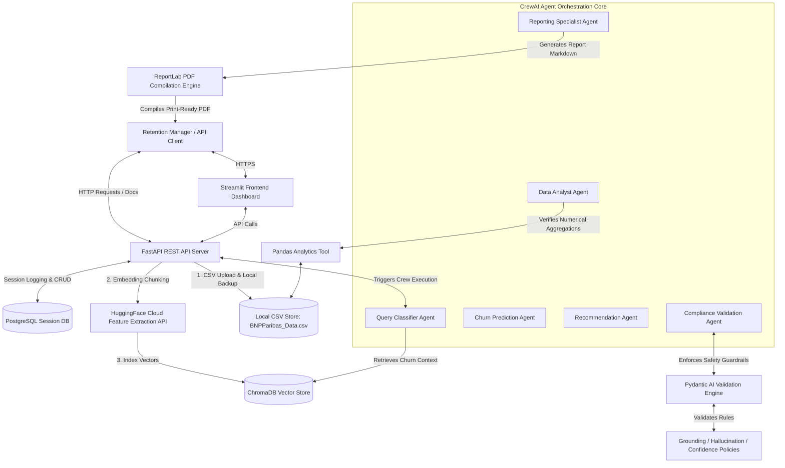

# Enterprise GenAI Customer Churn Intelligence Platform

A state-of-the-art, agentic AI platform for customer churn prediction, risk analysis, and personalized retention strategy generation.

---

## 🏦 Problem Statement

Traditional customer relationship management (CRM) systems primarily rely on static dashboards, basic historical filtering, and manual account reviews to track customer health. While these tools display raw metrics (like billing amounts or contract types), they lack intelligent reasoning capabilities, risk explainability, and proactive decision support. Consequently, customer success teams and retention managers spend excessive time manually identifying high-risk segments, parsing raw account histories, and drafting retention emails without clear guidance on the underlying factors or expected business impacts.

To address these inefficiencies, the **Enterprise GenAI Customer Churn Intelligence Platform** leverages a Multi-Agent Crew, Retrieval-Augmented Generation (RAG), and structured validation frameworks. The system ingests customer datasets, identifies critical churn risk factors, retrieves historical interaction memory, performs pandas-verified numerical aggregations, enforces compliance policies via Pydantic AI, and generates polished executive PDF summaries to empower retention managers with immediate, evidence-based recommendations.

---

## 🎯 Project Vision

Build a secure, scalable, and resilient customer retention platform capable of:
*   **Operational Risk Assessment**: Segmenting customers into clear risk tiers based on service contracts, ticket counts, and charges.
*   **Explainable AI Predictions**: Highlighting the specific billing, technical support, and contract factors driving churn risk.
*   **Data Grounding & Safety**: Guaranteeing that LLM reports are strictly backed by dataset numbers and free from hallucinations.
*   **Historical Contextual Memory**: Persisting session logs in a relational database and retrieving past session context dynamically.
*   **Professional Reporting**: Auto-compiling markdown reports into publication-grade, download-ready PDF documents.

---

## 🏗️ Project Architecture

The platform operates on a decoupled architecture containing a FastAPI backend service, a Streamlit analytics dashboard, a ChromaDB vector store for semantic context, and a PostgreSQL database for session memory.

### Platform Architecture Diagram

> [!NOTE]
> *If you have created a customized visual flowchart using **Napkin.ai**, you can link it here as a replacement:*
> ``

---

## 🚀 Project Goals

### Goal 1: Operational Risk Assessment
Automate the classification of customer account records into distinct risk tiers:
*   **High Risk (Churn Prob. ~82%)**: Typically characterized by Month-to-Month contracts, Fiber Optic internet services, and high technical support ticket counts ($\ge 2$).
*   **Medium Risk (Churn Prob. ~45%)**: Associated with 1-Year contracts and credit card payment options.
*   **Low Risk (Churn Prob. ~12%)**: Stabilized by long-term 2-Year contracts, low support ticket logs, and credit-card/bank-transfer auto-billing.

### Goal 2: Retention Decision Intelligence
Formulate strategic, targeted retention plays directly linked to identified risks:
*   **Targeted Customer Care**: Proactive outreach to customers in high-risk categories with unresolved technical tickets.
*   **Contract Loyalty Incentives**: Directing financial promotions (e.g. $10/month discounts) to encourage Month-to-Month users to transition to 1-Year or 2-Year agreements.
*   **Dedicated Technical Audits**: Scheduling network checks and line reviews for Fiber Optic users experiencing recurrent service dropouts.

### Goal 3: Risk Explainability
Generate transparent, human-readable rationales outlining the factors driving each prediction:
*   Clear tracking of monthly charge fluctuations and payment method changes.
*   Correlation logs mapping support ticket frequencies to churn probabilities.
*   Attribution lists linking every insight to the specific database row or agent that verified it.

### Goal 4: Operational Anomaly Detection
Intercept statistical inconsistencies and abnormal customer patterns:
*   Pinpointing billing outliers (unusually high monthly charges compared to contract medians).
*   Detecting contract type changes that violate standard retention paths.
*   Verifying all calculations (churn rates, averages, and counts) using a deterministic Pandas calculation tool rather than LLM text generation.

### Goal 5: Historical Case Investigation
Maintain long-term memory across sessions using a persistent PostgreSQL database:
*   Relate current customer queries to historical conversation logs using the `memory_records` and `user_sessions` schemas.
*   Compare current cohort metrics with similar historical churn groups to track retention policy performance over time.

### Goal 6: AI-Powered Executive Reporting
Draft clean, structured reports summarizing:
*   Current operational status (total uploads, processed data).
*   Identified customer segments and anomaly summaries.
*   Pandas-grounded statistical tables.
*   Final PDF exports compiled using custom styling sheets (company colors, page numbering, custom headers, and signature tables).

---

## 💎 Expected Outcomes

The GenAI Churn Intelligence Platform delivers a premium, end-to-end dashboard workspace featuring:
1.  **Fully Automated Churn Processing**: Upload customer tables and generate predictions in a single interface.
2.  **Guaranteed Grounding**: 0% mathematical hallucinations on customer counts and averages.
3.  **Actionable Strategy Generation**: Contextual recommendation tables ready to pass to account executives.
4.  **Exportable Deliverables**: Downloadable, print-ready PDF reports containing company branding.
5.  **Relational Persistence**: Permanent logs of past queries and agent thoughts.

---

## 🔗 Application Deployments

*   **FastAPI Backend URL**: [FastAPI Backend Service](https://customerchurnprediction-multiagents.onrender.com)
*   **FastAPI Swagger Docs**: [FastAPI Interactive Swagger UI Docs](https://customerchurnprediction-multiagents.onrender.com/docs)
*   **Frontend Application URL**: [Streamlit User Dashboard UI](https://customerchurnprediction-multiagents-jz9d.onrender.com)
*   **Uploaded Dataset Location**: Located locally inside the deployment container at `datasets/BNPParibas_Data.csv`.
